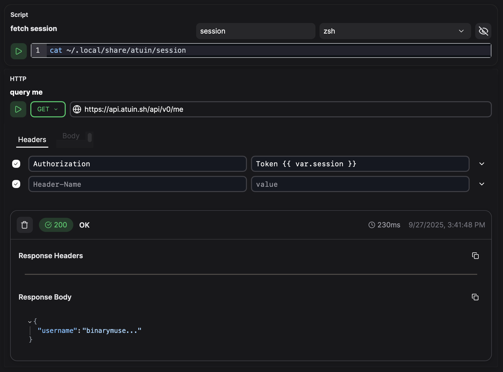

# Secrets

We don't currently have any native integration for secrets storage and management.

Using an [executable](../blocks/executable/ "mention") block, it is easy to integrate third party secrets management solutions or fetch secrets from the local filesystem. For example:

<figure class="img-light">
  <picture>
    
  </picture>
  <figcaption></figcaption>
</figure>
<figure class="img-dark">
  <picture>
    
  </picture>
  <figcaption></figcaption>
</figure>
