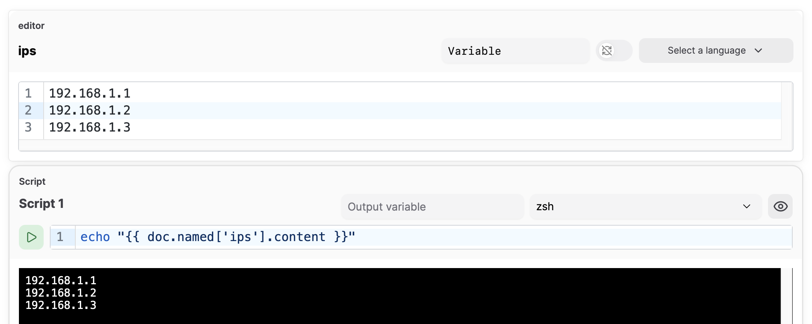
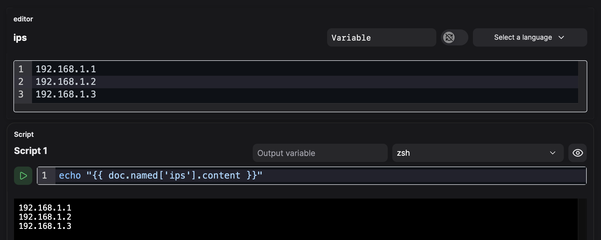

# Templating

#### **Templates**

Atuin uses [MiniJinja](https://docs.rs/minijinja) for rendering templates, enabling flexible output customization.

**Basic Syntax**

- **Variables**: `{{ var.variable_name }}`
  - Variables can be set by [script.md](blocks/executable/script.md "mention") blocks
- **Filters**: `{{ text | upper }}`, `{{ list | join(", ") }}`
- **Conditionals**:

```django

echo "foo is true"

echo "foo is false"

```

- **Loops**:

```django

echo "{{ remote }}"

```

**Built-in Functions**

- `range(n)`: Generates a sequence → `{{ i }}`
- `length(list)`: Gets list length → `{{ length(users) }}`
- `default(value, fallback)`: Uses fallback if `None` → `{{ user.name | default("Guest") }}`

See [Built-In Filters Reference](#built-in-filters-reference) for more.

**Custom Filters**

- `shellquote`: Escapes a string for safe use in shell commands → `{{ var.text | shellquote }}`
    - Uses POSIX single-quote escaping to handle special characters like quotes, backticks, dollar signs, etc.
    - Example: `echo {{ var.message | shellquote }}` safely handles any characters in the message variable
    - Particularly useful when passing variables that might contain user input or special characters

**Example Usage**

Before (verbose manual escaping):
```bash
echo "{{ var.test | replace("\"", "\\\"") }}"
```

After (using shellquote filter):
```bash
echo {{ var.test | shellquote }}
```

The `shellquote` filter handles all special shell characters automatically, including:
- Single quotes (`'`)
- Double quotes (`"`)
- Backticks (`` ` ``)
- Dollar signs (`$`)
- And other shell metacharacters

### Built-in Filters Reference

MiniJinja provides 50+ built-in filters for data transformation and formatting. Below is a comprehensive reference:

#### Type Conversion

- **`abs`**: Returns absolute value of a number
  ```django
  {{ -42 | abs }}  → 42
  ```

- **`int`**: Converts value to integer
  ```django
  {{ "42" | int }}  → 42
  ```

- **`float`**: Converts value to floating-point number
  ```django
  {{ "3.14" | float }}  → 3.14
  ```

- **`bool`**: Converts value to boolean
  ```django
  {{ "yes" | bool }}  → true
  ```

- **`string`**: Converts value to string
  ```django
  {{ 42 | string }}  → "42"
  ```

- **`list`**: Converts value to list
  ```django
  {{ "abc" | list }}  → ["a", "b", "c"]
  ```

#### String Manipulation

- **`upper`**: Converts string to uppercase
  ```django
  {{ "hello" | upper }}  → HELLO
  ```

- **`lower`**: Converts string to lowercase
  ```django
  {{ "HELLO" | lower }}  → hello
  ```

- **`capitalize`**: Capitalizes first character, lowercases rest
  ```django
  {{ "hELLO" | capitalize }}  → Hello
  ```

- **`title`**: Converts to title case
  ```django
  {{ "hello world" | title }}  → Hello World
  ```

- **`trim`**: Removes leading and trailing whitespace
  ```django
  {{ "  hello  " | trim }}  → hello
  ```

- **`replace`**: Replaces substring with another
  ```django
  {{ "Hello World" | replace("World", "MiniJinja") }}  → Hello MiniJinja
  ```

- **`split`**: Splits string into list
  ```django
  {{ "a,b,c" | split(",") }}  → ["a", "b", "c"]
  ```

- **`lines`**: Splits string into lines
  ```django
  {{ "line1\nline2" | lines }}  → ["line1", "line2"]
  ```

- **`indent`**: Indents text with spaces
  ```django
  {{ "text" | indent(4) }}  → "    text"
  ```

- **`escape`**: Escapes HTML special characters
  ```django
  {{ "<script>" | escape }}  → &lt;script&gt;
  ```

- **`safe`**: Marks string as safe (no escaping)
  ```django
  {{ html_content | safe }}
  ```

- **`urlencode`**: URL encodes value
  ```django
  {{ "hello world" | urlencode }}  → hello%20world
  ```

- **`format`**: Apply printf-style formatting
  ```django
  {{ "Hello %s" | format("World") }}  → Hello World
  ```

#### Sequence Operations

- **`first`**: Returns first item from sequence
  ```django
  {{ [1, 2, 3] | first }}  → 1
  ```

- **`last`**: Returns last item from sequence
  ```django
  {{ [1, 2, 3] | last }}  → 3
  ```

- **`length`**: Returns length of sequence or string
  ```django
  {{ [1, 2, 3] | length }}  → 3
  ```

- **`reverse`**: Reverses sequence or string
  ```django
  {{ [1, 2, 3] | reverse }}  → [3, 2, 1]
  ```

- **`sort`**: Sorts sequence
  ```django
  {{ [3, 1, 2] | sort }}  → [1, 2, 3]
  ```

- **`unique`**: Returns unique items from sequence
  ```django
  {{ [1, 2, 2, 3] | unique }}  → [1, 2, 3]
  ```

- **`join`**: Joins sequence with separator
  ```django
  {{ ["a", "b", "c"] | join(", ") }}  → a, b, c
  ```

- **`slice`**: Slices sequence into sublists
  ```django
  {{ [1, 2, 3, 4] | slice(2) }}  → [[1, 2], [3, 4]]
  ```

- **`batch`**: Groups items into batches of given size
  ```django
  {{ [1, 2, 3, 4, 5] | batch(2) }}  → [[1, 2], [3, 4], [5]]
  ```

- **`chain`**: Chains multiple iterables together
  ```django
  {{ [1, 2] | chain([3, 4]) }}  → [1, 2, 3, 4]
  ```

- **`zip`**: Zips multiple iterables into tuples
  ```django
  {{ pair }}  → (1, "a")(2, "b")
  ```

#### Aggregation

- **`sum`**: Sums all values in sequence
  ```django
  {{ [1, 2, 3] | sum }}  → 6
  ```

- **`min`**: Returns smallest item
  ```django
  {{ [3, 1, 2] | min }}  → 1
  ```

- **`max`**: Returns largest item
  ```django
  {{ [3, 1, 2] | max }}  → 3
  ```

#### Filtering & Selection

- **`select`**: Filters items that pass a test
  ```django
  {{ [1, 2, 3, 4] | select("odd") }}  → [1, 3]
  ```

- **`reject`**: Filters items that fail a test
  ```django
  {{ [1, 2, 3, 4] | reject("odd") }}  → [2, 4]
  ```

- **`selectattr`**: Filters by attribute value
  ```django
  {{ users | selectattr("active") }}
  ```

- **`rejectattr`**: Rejects by attribute value
  ```django
  {{ users | rejectattr("admin") }}
  ```

- **`map`**: Applies filter or gets attribute from each item
  ```django
  {{ users | map(attribute="name") | join(", ") }}
  ```

- **`groupby`**: Groups items by attribute
  ```django
  
    {{ group.grouper }}: {{ group.list | length }} users
  
  ```

#### Dictionary Operations

- **`items`**: Returns key-value pairs from dictionary
  ```django
  
    {{ key }}: {{ value }}
  
  ```

- **`dictsort`**: Sorts dictionary by keys
  ```django
  {{ {"z": 1, "a": 2} | dictsort }}  → [("a", 2), ("z", 1)]
  ```

- **`attr`**: Gets attribute from object
  ```django
  {{ user | attr("name") }}
  ```

#### Numeric Operations

- **`round`**: Rounds number to precision
  ```django
  {{ 3.14159 | round(2) }}  → 3.14
  ```

#### Data Serialization

- **`tojson`**: Converts value to JSON string
  ```django
  {{ {"key": "value"} | tojson }}  → {"key":"value"}
  ```

- **`pprint`**: Pretty prints value for debugging
  ```django
  {{ complex_data | pprint }}
  ```

#### Control Flow

- **`default`**: Returns default if value is undefined or falsy
  ```django
  {{ var.missing | default("fallback") }}  → fallback
  ```

### Document access

The template system has full access to the entire document - blocks, text, etc.

!!! warning
    We are still iterating on this API, and it is likely to change in future releases

First, give a block a name. Click the pencil icon next to the default name in the top left.

Then, it can be referred to via the `{{ doc.named }}`map, within the template system

<figure class="img-light">
  <picture>
    
  </picture>
  <figcaption>An example using an editor block's content from another block, via the template system</figcaption>
</figure>
<figure class="img-dark">
  <picture>
    
  </picture>
  <figcaption>An example using an editor block's content from another block, via the template system</figcaption>
</figure>
